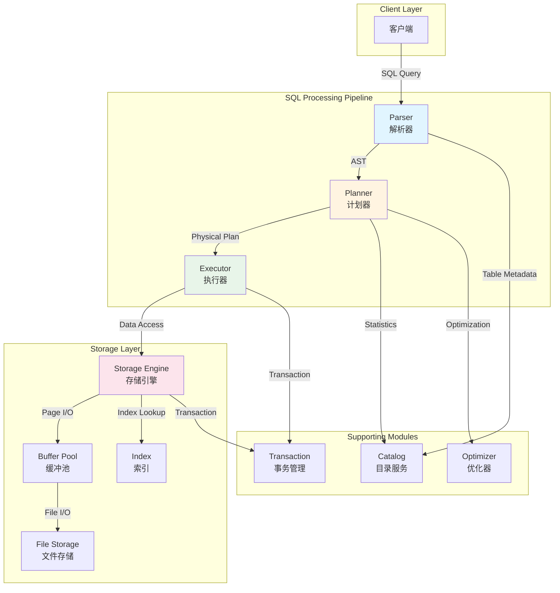
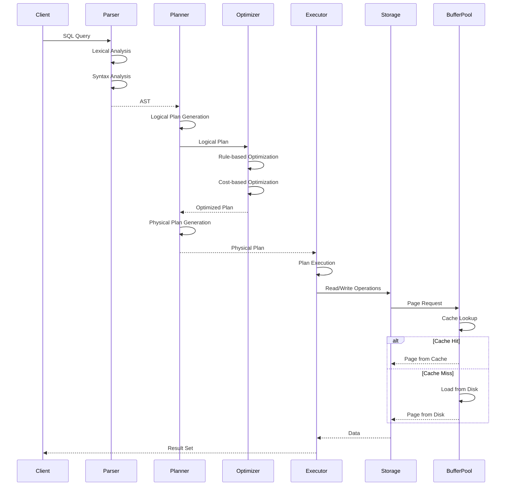
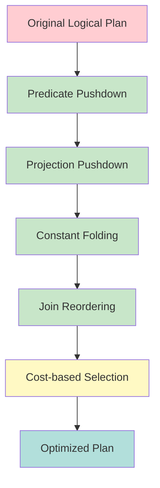
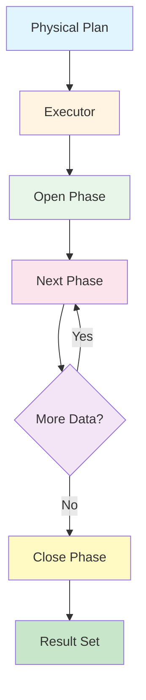
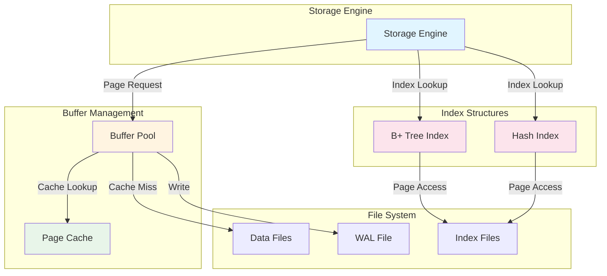
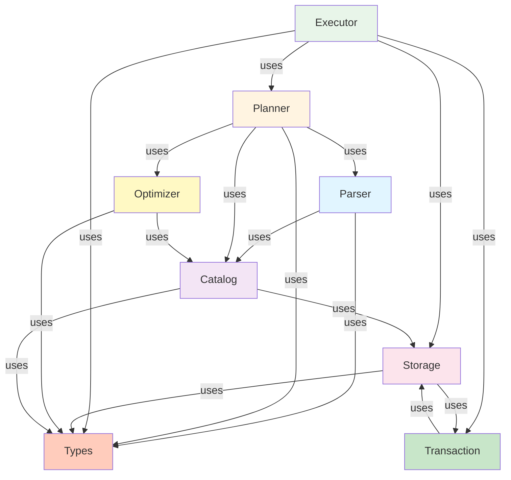
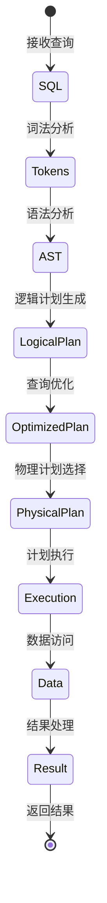

# SQLRustGo 模块架构设计

> **版本**: 1.0
> **创建日期**: 2026-03-21
> **目标**: 详细描述核心模块的职责、交互关系和接口设计

---

## 1. 架构概览

### 1.1 系统架构图



### 1.2 数据流图



---

## 2. Parser 模块

### 2.1 模块职责

Parser 模块负责将 SQL 文本转换为抽象语法树（AST），是查询处理的第一步。

**核心职责**:
- **词法分析**: 将 SQL 文本分解为 Token 序列
- **语法分析**: 根据 SQL 语法规则构建 AST
- **语义验证**: 检查表名、列名、类型等语义正确性
- **错误处理**: 提供清晰的语法错误信息

### 2.2 模块结构

```
parser/
├── lexer.rs          # 词法分析器
├── parser.rs         # 语法分析器
├── ast.rs            # AST 定义
└── token.rs          # Token 定义
```

### 2.3 接口设计

#### 2.3.1 Lexer 接口

```rust
pub struct Lexer {
    input: Vec<char>,
    position: usize,
    current_char: Option<char>,
}

impl Lexer {
    pub fn new(input: &str) -> Self;
    
    pub fn next_token(&mut self) -> Result<Token, ParseError>;
    
    pub fn tokenize(&mut self) -> Result<Vec<Token>, ParseError>;
}
```

#### 2.3.2 Parser 接口

```rust
pub struct Parser {
    tokens: Vec<Token>,
    current: usize,
}

impl Parser {
    pub fn new(tokens: Vec<Token>) -> Self;
    
    pub fn parse(&mut self) -> Result<Statement, ParseError>;
    
    pub fn parse_select(&mut self) -> Result<SelectStatement, ParseError>;
    
    pub fn parse_insert(&mut self) -> Result<InsertStatement, ParseError>;
    
    pub fn parse_update(&mut self) -> Result<UpdateStatement, ParseError>;
    
    pub fn parse_delete(&mut self) -> Result<DeleteStatement, ParseError>;
    
    pub fn parse_create_table(&mut self) -> Result<CreateTableStatement, ParseError>;
}
```

#### 2.3.3 AST 定义

```rust
pub enum Statement {
    Select(SelectStatement),
    Insert(InsertStatement),
    Update(UpdateStatement),
    Delete(DeleteStatement),
    CreateTable(CreateTableStatement),
    DropTable(DropTableStatement),
}

pub struct SelectStatement {
    pub columns: Vec<Expr>,
    pub from: TableReference,
    pub where_clause: Option<Expr>,
    pub group_by: Option<Vec<Expr>>,
    pub having: Option<Expr>,
    pub order_by: Option<Vec<SortExpr>>,
    pub limit: Option<usize>,
    pub offset: Option<usize>,
}

pub enum TableReference {
    BaseTable { name: String, alias: Option<String> },
    Join {
        left: Box<TableReference>,
        right: Box<TableReference>,
        join_type: JoinType,
        on_expr: Option<Expr>,
    },
    Subquery {
        subquery: Box<SelectStatement>,
        alias: String,
    },
}
```

### 2.4 处理流程


---

## 3. Planner 模块

### 3.1 模块职责

Planner 模块负责将 AST 转换为可执行的物理计划，包括逻辑计划生成、优化和物理计划选择。

**核心职责**:
- **逻辑计划生成**: 将 AST 转换为关系代数表示的逻辑计划
- **查询优化**: 应用优化规则和成本模型优化逻辑计划
- **物理计划选择**: 为逻辑操作选择最优的物理实现算法
- **计划验证**: 确保生成的计划是正确且可执行的

### 3.2 模块结构

```
planner/
├── logical_plan.rs    # 逻辑计划定义
├── physical_plan.rs   # 物理计划定义
├── optimizer.rs       # 优化器
├── planner.rs         # 计划生成器
└── cost.rs           # 成本模型
```

### 3.3 接口设计

#### 3.3.1 LogicalPlan 接口

```rust
pub enum LogicalPlan {
    Scan(ScanNode),
    Filter(FilterNode),
    Projection(ProjectionNode),
    Join(JoinNode),
    Aggregate(AggregateNode),
    Sort(SortNode),
    Limit(LimitNode),
}

pub struct ScanNode {
    pub table_name: String,
    pub columns: Vec<String>,
}

pub struct FilterNode {
    pub input: Box<LogicalPlan>,
    pub predicate: Expr,
}

pub struct ProjectionNode {
    pub input: Box<LogicalPlan>,
    pub expressions: Vec<Expr>,
}

pub struct JoinNode {
    pub left: Box<LogicalPlan>,
    pub right: Box<LogicalPlan>,
    pub join_type: JoinType,
    pub on_expr: Expr,
}
```

#### 3.3.2 PhysicalPlan 接口

```rust
pub enum PhysicalPlan {
    SeqScan(SeqScanExec),
    IndexScan(IndexScanExec),
    Filter(FilterExec),
    Projection(ProjectionExec),
    HashJoin(HashJoinExec),
    SortMergeJoin(SortMergeJoinExec),
    Aggregate(AggregateExec),
    Sort(SortExec),
    Limit(LimitExec),
}
```

#### 3.3.3 Planner 接口

```rust
pub trait Planner {
    fn plan(&self, statement: Statement) -> Result<PhysicalPlan, PlanError>;
}

pub struct DefaultPlanner {
    catalog: Arc<dyn Catalog>,
    optimizer: Arc<dyn Optimizer>,
}

impl Planner for DefaultPlanner {
    fn plan(&self, statement: Statement) -> Result<PhysicalPlan, PlanError> {
        let logical_plan = self.create_logical_plan(statement)?;
        let optimized_plan = self.optimizer.optimize(logical_plan)?;
        let physical_plan = self.create_physical_plan(optimized_plan)?;
        Ok(physical_plan)
    }
}
```

#### 3.3.4 Optimizer 接口

```rust
pub trait Optimizer {
    fn optimize(&self, plan: LogicalPlan) -> Result<LogicalPlan, OptimizeError>;
}

pub struct DefaultOptimizer {
    rules: Vec<Box<dyn OptimizerRule>>,
    cost_model: Arc<dyn CostModel>,
}

impl Optimizer for DefaultOptimizer {
    fn optimize(&self, plan: LogicalPlan) -> Result<LogicalPlan, OptimizeError> {
        let mut plan = plan;
        
        for rule in &self.rules {
            plan = rule.apply(plan)?;
        }
        
        Ok(plan)
    }
}

pub trait OptimizerRule {
    fn apply(&self, plan: LogicalPlan) -> Result<LogicalPlan, OptimizeError>;
}
```

### 3.4 优化规则



---

## 4. Executor 模块

### 4.1 模块职责

Executor 模块负责执行物理计划，处理数据流并返回结果。

**核心职责**:
- **计划执行**: 按照物理计划的顺序执行操作
- **数据流处理**: 使用迭代器模型处理数据流
- **向量化执行**: 批量处理数据以提高性能
- **资源管理**: 管理内存、CPU 等资源
- **结果收集**: 收集并返回查询结果

### 4.2 模块结构

```
executor/
├── executor.rs           # 执行器核心
├── operators/            # 操作符实现
│   ├── scan.rs
│   ├── filter.rs
│   ├── projection.rs
│   ├── join.rs
│   ├── aggregate.rs
│   └── sort.rs
├── vectorization.rs      # 向量化执行
├── batch.rs              # RecordBatch
└── metrics.rs            # 执行指标
```

### 4.3 接口设计

#### 4.3.1 Executor 接口

```rust
pub trait Executor: Send {
    fn open(&mut self) -> Result<(), ExecError>;
    fn next(&mut self) -> Result<Option<RecordBatch>, ExecError>;
    fn close(&mut self) -> Result<(), ExecError>;
}

pub struct VolcanoExecutor {
    plan: PhysicalPlan,
    storage: Arc<dyn StorageEngine>,
}

impl Executor for VolcanoExecutor {
    fn open(&mut self) -> Result<(), ExecError> {
        self.plan.open(self.storage.clone())
    }

    fn next(&mut self) -> Result<Option<RecordBatch>, ExecError> {
        self.plan.next()
    }

    fn close(&mut self) -> Result<(), ExecError> {
        self.plan.close()
    }
}
```

#### 4.3.2 Operator 接口

```rust
pub trait Operator: Send {
    fn open(&mut self) -> Result<(), ExecError>;
    fn next_batch(&mut self) -> Result<Option<RecordBatch>, ExecError>;
    fn close(&mut self) -> Result<(), ExecError>;
}

pub struct ScanOperator {
    table_name: String,
    storage: Arc<dyn StorageEngine>,
    iterator: Option<Box<dyn RecordIterator>>,
}

impl Operator for ScanOperator {
    fn open(&mut self) -> Result<(), ExecError> {
        let scanner = self.storage.scan(&self.table_name, None)?;
        self.iterator = Some(Box::new(scanner));
        Ok(())
    }

    fn next_batch(&mut self) -> Result<Option<RecordBatch>, ExecError> {
        if let Some(ref mut iter) = self.iterator {
            iter.next_batch()
        } else {
            Ok(None)
        }
    }

    fn close(&mut self) -> Result<(), ExecError> {
        self.iterator = None;
        Ok(())
    }
}
```

#### 4.3.3 RecordBatch 接口

```rust
pub struct RecordBatch {
    pub schema: Arc<Schema>,
    pub columns: Vec<ArrayRef>,
    pub row_count: usize,
}

impl RecordBatch {
    pub fn new(schema: Arc<Schema>, columns: Vec<ArrayRef>) -> Self;
    
    pub fn empty() -> Self;
    
    pub fn num_rows(&self) -> usize;
    
    pub fn num_columns(&self) -> usize;
    
    pub fn column(&self, index: usize) -> &ArrayRef;
    
    pub fn slice(&self, offset: usize, length: usize) -> Self;
}
```

### 4.4 执行流程



---

## 5. Storage 模块

### 5.1 模块职责

Storage 模块负责数据的持久化、页管理、缓冲区管理和索引管理。

**核心职责**:
- **数据持久化**: 将数据写入磁盘并持久化存储
- **页管理**: 管理数据页的分配、读取和写入
- **缓冲区管理**: 管理内存中的页缓存，提高 I/O 性能
- **索引管理**: 支持多种索引结构（B+树、哈希等）
- **事务支持**: 提供事务隔离和恢复机制
- **统计信息**: 收集和维护表的统计信息

### 5.2 模块结构

```
storage/
├── engine.rs           # 存储引擎接口
├── page.rs             # 页定义
├── buffer_pool.rs      # 缓冲池
├── file_storage.rs    # 文件存储
├── heap.rs             # 堆存储
├── bplus_tree/         # B+树索引
│   ├── mod.rs
│   └── index.rs
├── wal.rs              # Write-Ahead Log
└── stats.rs            # 统计信息
```

### 5.3 接口设计

#### 5.3.1 StorageEngine 接口

```rust
pub trait StorageEngine: Send + Sync {
    fn create_table(&self, name: &str, schema: Schema) -> Result<(), StorageError>;
    
    fn drop_table(&self, name: &str) -> Result<(), StorageError>;
    
    fn insert(&self, table: &str, records: Vec<Record>) -> Result<(), StorageError>;
    
    fn delete(&self, table: &str, predicate: Option<Expr>) -> Result<usize, StorageError>;
    
    fn update(&self, table: &str, updates: Vec<UpdateExpr>, predicate: Option<Expr>) 
        -> Result<usize, StorageError>;
    
    fn scan(&self, table: &str, predicate: Option<Expr>) -> Result<Box<dyn RecordIterator>, StorageError>;
    
    fn get_stats(&self, table: &str) -> Result<TableStats, StorageError>;
}
```

#### 5.3.2 BufferPool 接口

```rust
pub struct BufferPool {
    capacity: usize,
    page_size: usize,
    pages: HashMap<PageId, Page>,
    lru: LruCache<PageId, ()>,
}

impl BufferPool {
    pub fn new(capacity: usize, page_size: usize) -> Self;
    
    pub fn get_page(&mut self, page_id: PageId) -> Result<&Page, StorageError>;
    
    pub fn get_page_mut(&mut self, page_id: PageId) -> Result<&mut Page, StorageError>;
    
    pub fn allocate_page(&mut self) -> Result<PageId, StorageError>;
    
    pub fn flush(&mut self) -> Result<(), StorageError>;
    
    pub fn evict(&mut self) -> Result<(), StorageError>;
}
```

#### 5.3.3 Page 接口

```rust
pub struct Page {
    pub id: PageId,
    pub data: Vec<u8>,
    pub is_dirty: bool,
    pub pin_count: usize,
}

impl Page {
    pub fn new(id: PageId, size: usize) -> Self;
    
    pub fn read<T>(&self, offset: usize) -> Result<T, StorageError>;
    
    pub fn write<T>(&mut self, offset: usize, value: T) -> Result<(), StorageError>;
    
    pub fn pin(&mut self);
    
    pub fn unpin(&mut self);
}
```

#### 5.3.4 Index 接口

```rust
pub trait Index: Send + Sync {
    fn insert(&mut self, key: Value, row_id: RowId) -> Result<(), StorageError>;
    
    fn delete(&mut self, key: &Value) -> Result<(), StorageError>;
    
    fn lookup(&self, key: &Value) -> Result<Vec<RowId>, StorageError>;
    
    fn range_scan(&self, start: &Value, end: &Value) -> Result<Vec<RowId>, StorageError>;
}

pub struct BPlusTree {
    root: Option<NodeId>,
    order: usize,
    storage: Arc<dyn IndexStorage>,
}

impl Index for BPlusTree {
    fn insert(&mut self, key: Value, row_id: RowId) -> Result<(), StorageError> {
        self.insert_key(key, row_id)
    }
    
    fn delete(&mut self, key: &Value) -> Result<(), StorageError> {
        self.delete_key(key)
    }
    
    fn lookup(&self, key: &Value) -> Result<Vec<RowId>, StorageError> {
        self.search_key(key)
    }
    
    fn range_scan(&self, start: &Value, end: &Value) -> Result<Vec<RowId>, StorageError> {
        self.range_search(start, end)
    }
}
```

### 5.4 存储架构



---

## 6. 模块交互关系

### 6.1 依赖关系图



### 6.2 数据流转



---

## 7. 接口契约

### 7.1 错误处理

所有模块使用统一的错误类型：

```rust
pub enum SqlError {
    ParseError(ParseError),
    PlanError(PlanError),
    ExecError(ExecError),
    StorageError(StorageError),
    TransactionError(TransactionError),
}

pub type SqlResult<T> = Result<T, SqlError>;
```

### 7.2 生命周期管理

```rust
pub trait Lifecycle {
    fn open(&mut self) -> Result<(), SqlError>;
    fn close(&mut self) -> Result<(), SqlError>;
    fn is_open(&self) -> bool;
}
```

### 7.3 可观测性

```rust
pub trait Observable {
    fn get_metrics(&self) -> Metrics;
    fn reset_metrics(&mut self);
}

pub struct Metrics {
    pub operations_count: usize,
    pub total_time: Duration,
    pub memory_usage: usize,
}
```

---

## 8. 性能优化策略

### 8.1 向量化执行

- 使用 RecordBatch 批量处理数据
- SIMD 指令加速计算
- 列式存储提高缓存命中率

### 8.2 查询优化

- 谓词下推减少数据扫描
- 投影裁剪减少数据传输
- Join 重排序降低中间结果大小
- 索引选择优化访问路径

### 8.3 存储优化

- 缓冲池管理减少磁盘 I/O
- B+树索引加速查询
- 数据压缩减少存储空间
- 预取技术提高 I/O 吞吐

---

## 9. 扩展性设计

### 9.1 插件机制

```rust
pub trait Plugin: Send + Sync {
    fn name(&self) -> &str;
    fn version(&self) -> &str;
    fn initialize(&mut self) -> Result<(), SqlError>;
    fn shutdown(&mut self) -> Result<(), SqlError>;
}
```

### 9.2 自定义函数

```rust
pub trait ScalarFunction: Send + Sync {
    fn name(&self) -> &str;
    fn return_type(&self, arg_types: &[DataType]) -> DataType;
    fn evaluate(&self, args: &[Value]) -> Result<Value, SqlError>;
}
```

### 9.3 自定义存储后端

```rust
pub trait StorageBackend: Send + Sync {
    fn read_page(&self, page_id: PageId) -> Result<Page, StorageError>;
    fn write_page(&self, page: &Page) -> Result<(), StorageError>;
    fn allocate_page(&self) -> Result<PageId, StorageError>;
}
```

---

## 10. 总结

本架构设计定义了 SQLRustGo 数据库的四个核心模块：

1. **Parser**: 负责 SQL 解析，生成 AST
2. **Planner**: 负责查询计划生成和优化
3. **Executor**: 负责物理计划执行
4. **Storage**: 负责数据持久化和存储管理

模块之间通过清晰的接口进行交互，遵循单一职责原则，具有良好的可扩展性和可维护性。

---

## 变更记录

| 日期 | 版本 | 变更说明 |
|------|------|----------|
| 2026-03-21 | 1.0 | 初始版本，定义核心模块架构 |
